<div align="center">

# Hi there 👋 I'm Hemanth
### They call me Neon

Java Developer • Minecraft Systems Engineer • Backend Developer  
Building scalable Minecraft infrastructure and distributed backend systems.


[](https://discord.gg/QvgyhQPyn3)
[](https://instagram.com/hemanthsp.dev)

</div>

---

## About Me

- Java developer focused on Minecraft backend systems  
- Building cross-server infrastructure and machine sync networks  
- Experience with Velocity proxy, Redis and distributed architecture  
- Familiar with Discord bot development and API integrations  
- Basic web development knowledge (React / Node / REST)  
- Arch Linux user for development and server management  


---

## Minecraft Network


Cross-server Minecraft infrastructure with machine sync and region based routing.

```
play.ninesmp.fun
```

```
play.ninemc.fun
```

---

## Arch btw 🐧


---

## Tech Stack


<br/>


<br/>

<a href="https://github.com/neonjava" target="_blank">
  


